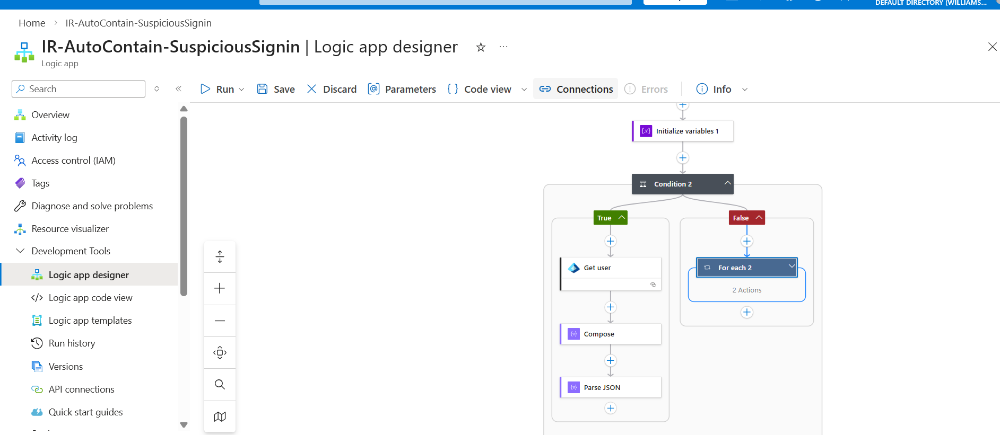

# Sentinel-SOAR-AutoContain-SusSignIn

Azure Sentinel SOAR playbook that automatically enriches incidents, extracts entities, evaluates risk context, and performs automated response logic aligned with Zero Trust and CMMC Level 2 security practices.

---

## Overview

IR-AutoContain-SuspiciousSignin is a Microsoft Sentinel Logic App (Consumption) playbook designed to support automated incident response workflows.

The playbook analyzes incident entities, determines whether a user or IP is present, applies conditional logic based on enrichment data, and generates structured incident comments for SOC visibility.

Primary capabilities include:

- Entity extraction
- Conditional response logic
- Automated incident comment generation
- Risk score evaluation workflow
- User or IP fallback handling
- Microsoft Defender XDR integration

This project demonstrates practical SOAR engineering using Azure Sentinel automation.

---

## Architecture

### Workflow Architecture

### Detailed Logic Flow
.png)

### Example Incident Output

---

## Playbook Logic

### 1. Entity Enrichment
- Retrieves Account and IP entities from Sentinel incidents.
- Determines whether a User Principal Name exists.
- Falls back to IP-based logic when no user entity is found.

### 2. Conditional Decision Engine
The playbook evaluates:

- Presence of user entity
- Extracted risk score
- Incident context

Conditional branches allow:

- User enrichment using Microsoft Graph
- IP fallback logic
- Dynamic automation decisions

### 3. Incident Comment Generation
The playbook posts structured comments into Microsoft Defender XDR including:

- AI decision output
- Risk evaluation result
- Automation execution details

---

## Repository Structure

playbook/  
 └── IR-AutoContain-SuspiciousSignin.json   # Exported Logic App template  

Architecture.png                             # Workflow diagram  
Architecture2 (2).png                       # Detailed architecture view  
Playbook Message.png                        # Example incident output  
README.md

---

## Deployment

### Prerequisites

- Microsoft Sentinel enabled
- Logic App (Consumption) permissions
- Microsoft Defender XDR integration configured

### Steps

1. Navigate to Microsoft Sentinel
2. Go to Automation
3. Create a new Logic App (Consumption)
4. Import the JSON template located in:

playbook/IR-AutoContain-SuspiciousSignin.json

5. Configure required API connections:
   - Microsoft Sentinel
   - Microsoft Graph 
   - Azure Resource Manager

6. Attach the playbook to an Analytics Rule or Incident Trigger.

---

## Example Workflow

1. Sentinel incident triggers the playbook.
2. Entities are extracted.
3. Conditional logic determines:
   - User-based enrichment
   - IP-based fallback
4. Risk score is evaluated.
5. Playbook posts a structured comment into the incident activity timeline.

---

## Security Alignment

This project demonstrates alignment with:

- Zero Trust automation principles
- Microsoft Sentinel SOAR best practices
- CMMC Level 2 Incident Response concepts
- Automated enrichment and containment workflows

---

## Author

Devon Williams  
Cybersecurity | Cloud Security | DevSecOps | SOAR Engineering
